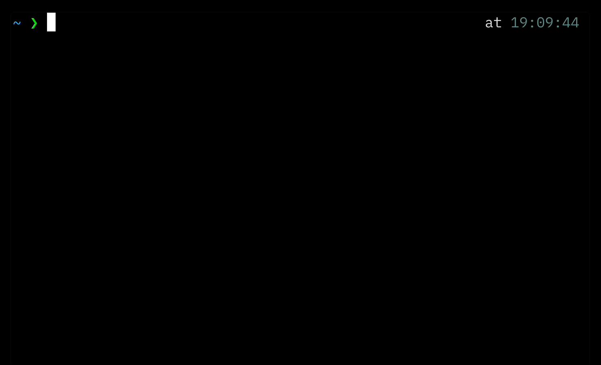

# Snip



Snip (snippets) is a command-line tool for managing your snippets using a local SQLite database.

## Usage

This command installs the binary in your GOBIN directory (default: `~/go/bin`). It also creates a SQLite database file at a fixed location in your home directory: `~/.config/snip/local.db`.

```bash
go install github.com/iamhectorsosa/snip@latest
```

**Note:** This tool is currently implemented only for macOS (Darwin). Support for other operating systems has not been implemented yet.

## Commands

Run the help command to get an updated list of all commands.

```bash
❯ snip help
Snip is a CLI tool for managing your snippets.

To get a snippet, use: snip [key] [...$1]
To add snippets, use: snip [key='value']

Usage:
  snip [key] [...$1] | [key='value'] [flags]
  snip [command]

Available Commands:
  delete      Delete a snippet
  help        Help about any command
  ls          List all snippets
  update      Update a snipppet
```

## Development

1. Clone the repository:

```bash
git clone github.com/iamhectorsosa/snip
cd snip
```

2. Build the project:

```bash
CGO_ENABLED=1 go build -v -o snip .
```
